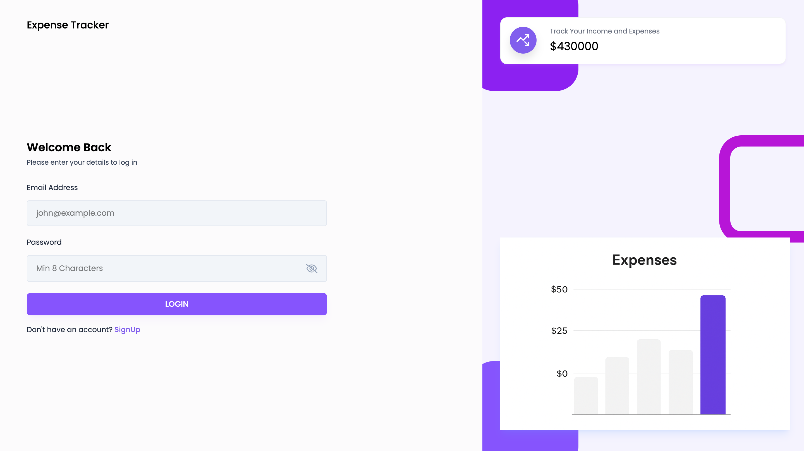
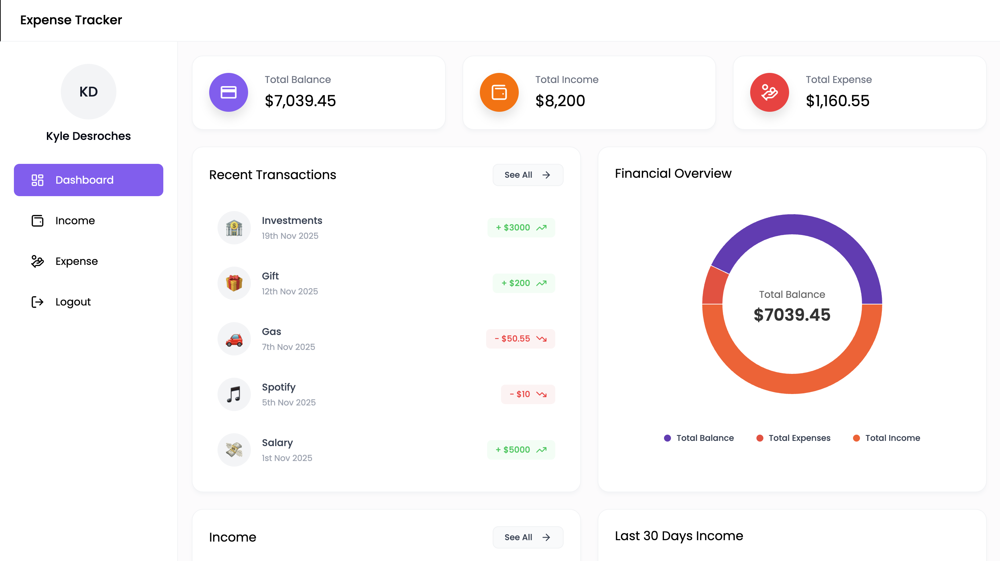
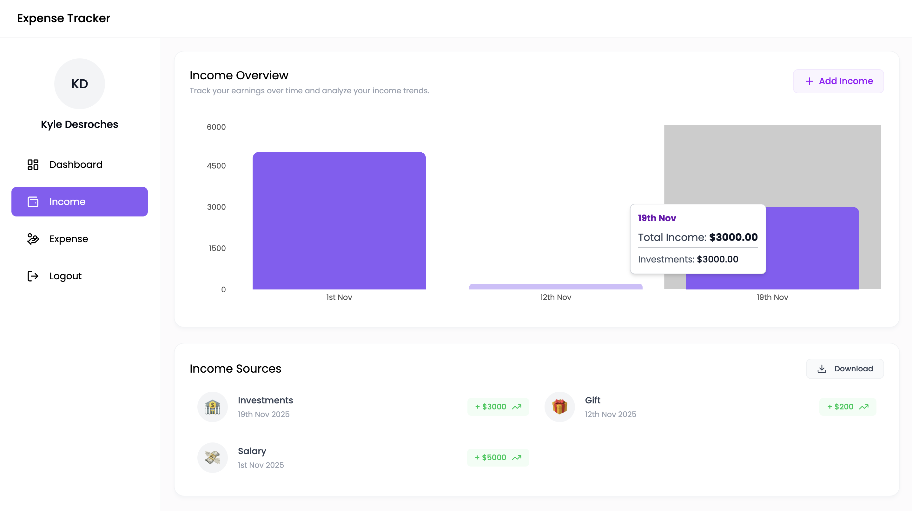
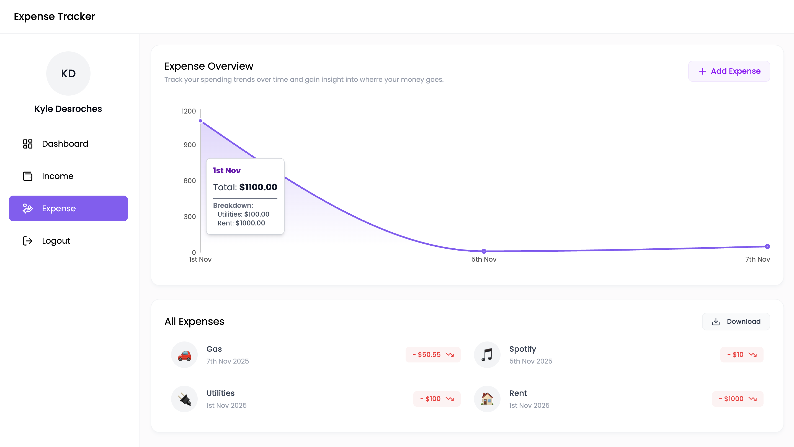

# 💰 CashFlow

A full-stack personal finance application that allows users to track their income and expenses in real-time. This project features a modern, responsive UI with data visualization to help users understand their spending habits.

## 🚀 Key Features
* **Authentication:** Secure Login/Signup functionality using JWT (JSON Web Tokens).
* **Visual Reports:** Interactive charts (Pie, Bar, & Line) to analyze spending trends over the last 30 days.
* **Transaction Management:** Add, delete, and categorize income and expenses effortlessly.
* **Data Export:** Download financial reports as Excel/CSV files for offline analysis.
* **Responsive Design:** Fully optimized for mobile and desktop usage.

---

## 📸 Application Screenshots

This section provides a visual overview of the key pages and functionality.

| Page | Description | Screenshot |
| :--- | :--- | :--- |
| **Login / Signup** | Secure authentication portal for user access. |  |
| **Dashboard** | Central hub showing summarized financial data and trends. |  |
| **Income Page** | Dedicated view for adding, viewing, and managing all income streams. |  |
| **Expense Page** | Dedicated view for tracking and categorizing all spending. |  |

---

## 🛠️ Tech Stack
**Frontend:**
* React.js (Hooks & Context API)
* Styled Components / Tailwind CSS
* Recharts (for data visualization)

**Backend:**
* Node.js & Express.js (RESTful API)
* MongoDB & Mongoose (Database & ODM)
* JWT (Authentication)

## 📦 How to Run Locally

1.  **Clone the repository**
    ```bash
    git clone https://github.com/desrocheskyle/CashFlow.git
    cd expense-tracker
    ```

2.  **Install Dependencies (Backend & Frontend)**
    ```bash
    # Backend
    cd backend
    npm install

    # Frontend
    cd ../frontend
    npm install
    ```

3.  **Environment Variables**
    Create a `.env` file in the `backend` folder and add the following:
    ```env
    PORT=5000
    MONGO_URL=your_mongodb_connection_string
    JWT_SECRET=your_jwt_secret_key
    ```

4.  **Start the App**
    ```bash
    # Run Backend
    cd backend
    npm start

    # Run Frontend (in a separate terminal)
    cd frontend
    npm start
    ```

## 🔮 Future Improvements
* [ ] Add Dark Mode support.
* [ ] Enable recurring transactions (e.g., monthly rent).
* [ ] Add budget limits and email alerts.


---
*Created by Kyle DesRoches - Feel free to contact me!*
